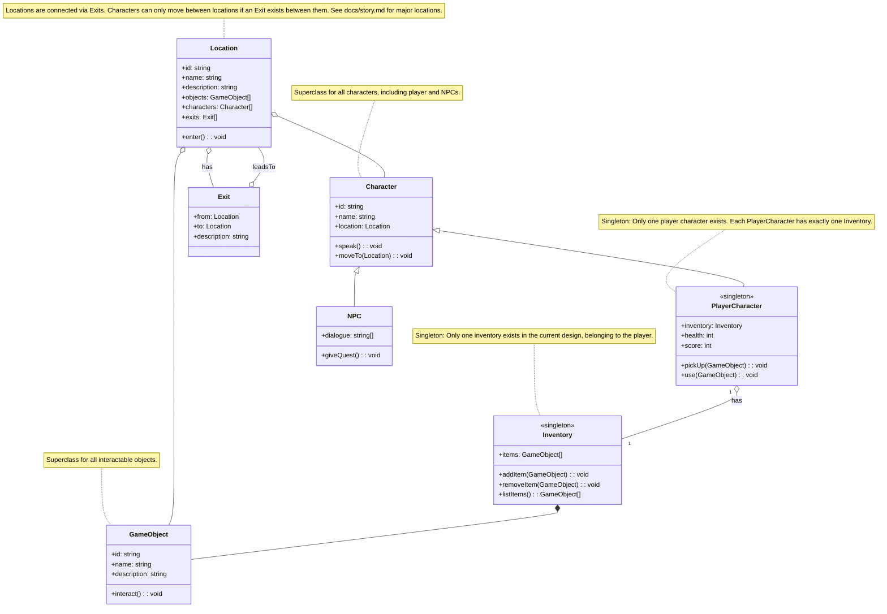

# Game Class Diagram (Mermaid)

---

This diagram follows the pillars of OOP:
- **Abstraction:** Common properties and methods are abstracted into superclasses (GameObject, Character).
- **Inheritance:** PlayerCharacter and NPC inherit from Character.
- **Encapsulation:** Properties and methods are grouped logically within classes.
- **Polymorphism:** Methods like `interact()` and `speak()` can be overridden by subclasses. 