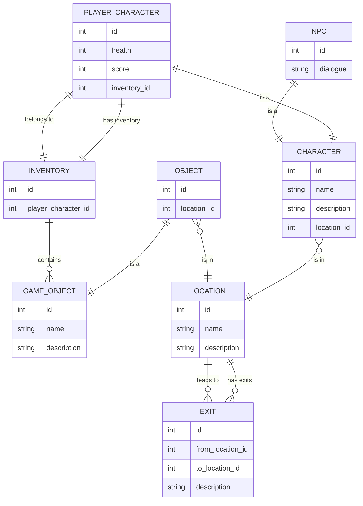

# Entity Relationship Diagram (ERD)

---

- Table Per Type (TPT) strategy: Each subclass table (PLAYER_CHARACTER, NPC, OBJECT) references its superclass (CHARACTER or GAME_OBJECT) by id.
- Every `CHARACTER` and `OBJECT` is always in a `LOCATION` (including inventory as a special location).
- `INVENTORY` has a 1:1 relationship with `PLAYER_CHARACTER` (each player has only one inventory).
- `INVENTORY` contains `GAME_OBJECT`s.
- `EXIT` connects locations (rooms) and can be zero or more per location. Characters can only move between locations if an EXIT (connection) exists between them.
- Major locations are listed in `docs/story.md` under "Major Locations". 