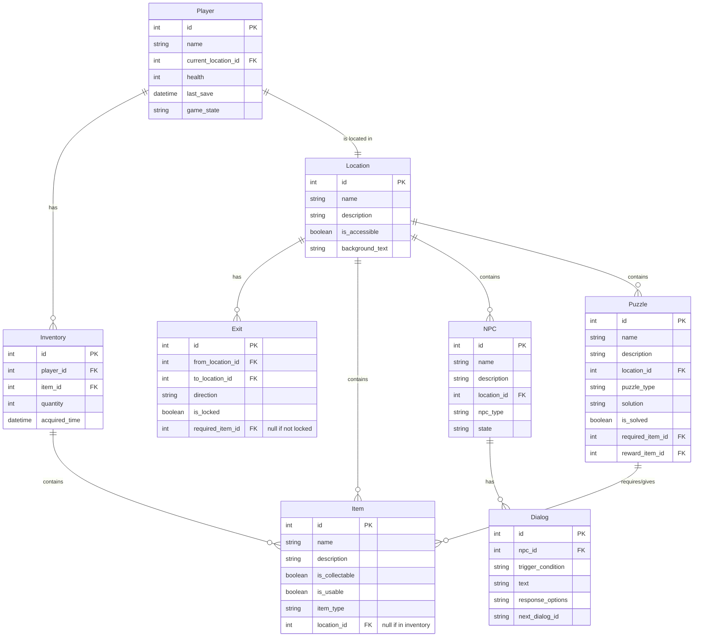

# Entity Relationship Diagram - Web Student Quest

## Database Structure

## Entity Descriptions

### Player
- Central entity representing the player character
- Tracks current location, inventory, and game state
- Health system for potential future combat mechanics

### Location
- Represents the 10 game locations
- Contains descriptions and accessibility flags
- Links to items, NPCs, and puzzles present in the location

### Exit
- Connects locations through directional exits (N,E,S,W)
- Supports locked exits requiring specific items

### Item
- Represents collectible and usable objects
- Can be present in locations or inventory
- Used for puzzle solutions and progression

### Inventory
- Tracks items collected by the player
- Supports multiple instances of items
- Records when items were acquired

### NPC
- Represents the 2 non-player characters
- Contains state for dynamic behavior
- Links to dialog trees

### Dialog
- Structures NPC conversations
- Supports branching dialog trees
- Can trigger game state changes

### Puzzle
- Represents the 3 puzzles and boss encounter
- Tracks completion state
- Links to required items and rewards

## Implementation Notes
1. All tables will be initially implemented as CSV files
2. Foreign keys ensure data integrity
3. Timestamps enable future save/load functionality
4. Flexible structure allows for future expansion