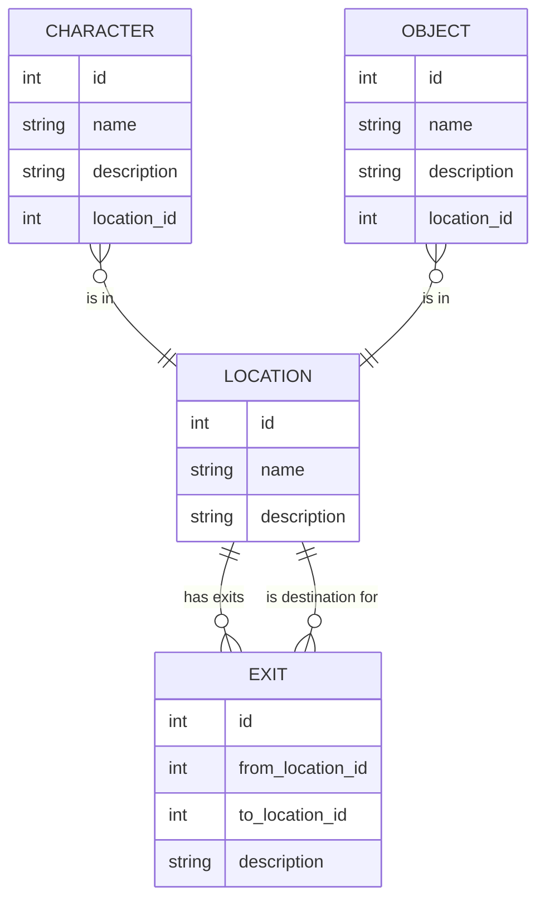

# Entity Relationship Diagram (ERD)

---

- Every `CHARACTER` and `OBJECT` is always in a `LOCATION` (including inventory as a special location).
- `LOCATION` can represent rooms or the player inventory.
- `EXIT` connects locations (rooms) and can be zero or more per location. 